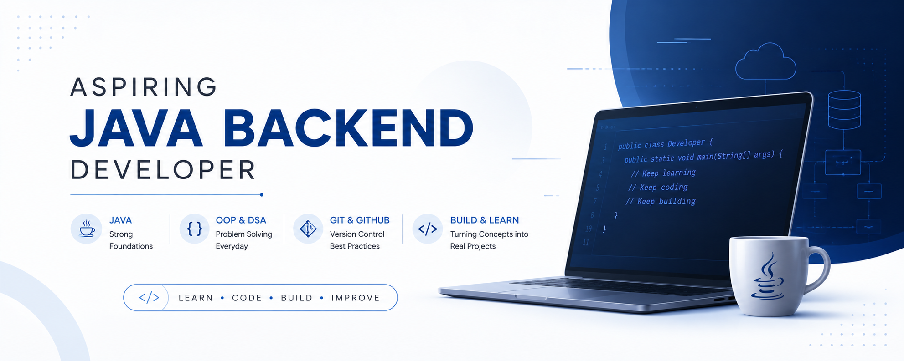

<p align="center">
  
</p>

<h1 align="center">Hi 👋, I'm Ravi Baishya</h1>

<p align="center">
  <strong>Java Backend Developer in Progress ☕</strong><br/>
  Building strong foundations in Java, OOP, DSA and professional development practices.
</p>

<p align="center">
  <a href="https://github.com/ravibaishya"></a>
  <a href="https://www.linkedin.com/in/ravibaishya/"></a>
  <a href="mailto:ravibaishya.dev@gmail.com"></a>
</p>

---

## 👨‍💻 About Me

I'm currently on a focused journey toward becoming a **professional Java Backend Developer**. I learn through structured study, hands-on coding, problem solving, and documenting what I build.

- ☕ Building a strong foundation in **Java & Object-Oriented Programming**
- 🧠 Practicing **Data Structures & Algorithms with Java**
- 🔧 Learning **Git & GitHub** and professional software-development practices
- 🚀 Turning concepts into practical programs and projects
- 📚 Maintaining a public record of my learning and progress
- 🎯 Long-term focus: **Java Backend Development & real-world applications**

---

## 🛠️ Technical Toolkit

### ☕ Core Development


### 🔧 Tools & Version Control


> **Next on the roadmap:** backend technologies and databases will be added as I learn and use them in real projects.

---

### Current focus

| Area | Focus |
|---|---|
| ☕ Java | Programming fundamentals, OOP and core concepts |
| 🔧 Git/GitHub | Version control, repositories and professional workflow |
| 🚀 Backend | Building toward Java backend development |

---

## 🚀 Featured Learning Projects

| Project | What it contains | Status |
|---|---|---|
| ☕ [Java Learning Journey](https://github.com/ravibaishya/Java-Learning-Journey) | Java concepts, practice programs and hands-on learning | 🟢 Active |

> More practical Java and backend projects will be featured here as they are built.

---

## 📈 Developer Journey

```text
LEARN  →  CODE  →  PRACTICE  →  BUILD  →  IMPROVE
```

I focus on understanding **why** something works, not just memorizing syntax. Each topic becomes an opportunity to write code, solve problems, make mistakes, and improve.

---

## 📊 GitHub Stats

<div align="center">


</div>

---

## 🤝 Let's Connect

<p align="center">
  <a href="https://www.linkedin.com/in/ravibaishya/"></a>
  <a href="mailto:ravibaishya.dev@gmail.com"></a>
</p>

<p align="center">
  <em>Learning • Building • Improving — one commit at a time. ☕</em>
</p>
